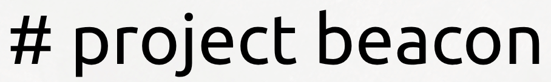

<p align="center">
  
</p>

# Project Beacon

Cloud-first Ground Control Station for autonomous drone swarms in search and rescue operations with optional Starlink backup.

## Why We Built This

First responders need intuitive control systems for autonomous drone swarms during disaster response. Traditional systems require complex manual controls. Project Beacon uses cloud AI to interpret natural language commands and coordinate multi-drone missions with real-time 3D visualization.

## What It Does

Project Beacon translates plain English commands into coordinated drone swarm actions. The system uses Google's Gemini 2.5 Flash for AI orchestration, with optional Starlink connectivity for backup internet in remote locations.

## Features

- Natural language mission control via Google ADK multi-agent system
- Real-time 3D simulation with React Three Fiber
- Cloud-first architecture with optional Starlink backup connectivity
- gRPC-based drone communication in simulated environment

## Stack

| Layer | Technology |
|-------|-----------|
| Desktop | Tauri + Next.js (SSG) |
| Backend | FastAPI + Google ADK + FastMCP |
| AI | Gemini 2.5 Flash (or local Ollama) |
| Visualization | React Three Fiber |
| Drone Control | gRPC + Protobuf |
| Telemetry | UDP broadcast + WebSocket |
| Simulation | Docker + Python |
| Storage | SQLite |

## How the Agent System Works

Commander Agent receives natural language input and routes to specialist agents:

- **Navigation Agent**: flight path planning, sweep patterns, return-to-base
- **Scan Workflow**: building/area scan orchestration with thermal detection
- **Supply Workflow**: parallel survivor supply delivery coordination

### Execution Flow

```
User: "Scan building at -15, -20 for survivors"
  → Commander Agent (routes task)
  → Scan Workflow (selects nearest drone)
  → Navigation Agent (move_to tool via FastMCP)
  → gRPC client (Protobuf message)
  → Docker drone container (updates position/battery)
  → UDP telemetry broadcast
  → WebSocket relay to frontend
  → React Three Fiber renders new position
```

### Agent Architecture

```
Commander Agent
    ├─ Navigation Agent
    │   └─ Tools: move_to, sweep, return, status
    ├─ Scan Workflow
    │   └─ Orchestrates: drone selection → navigation → thermal scan → report
    └─ Supply Workflow
        └─ Orchestrates: survivor detection → drone assignment → parallel dispatch
```

All tool calls translate through FastMCP into gRPC commands sent to simulated drone containers running in Docker.

## Quick Start

### Prerequisites

- Python 3.12+
- `uv`
- Docker + Docker Compose
- Gemini API key (get from [Google AI Studio](https://aistudio.google.com/apikey))
- Optional: Langfuse account for LLM observability

### Configuration

Create `backend/.env` with your credentials:

```bash
# Required: Gemini API
GEMINI_API_KEY=your-gemini-key-here
GOOGLE_GENAI_USE_VERTEXAI=false

# Optional: Langfuse observability (remove if not using)
LANGFUSE_PUBLIC_KEY=pk-lf-xxx
LANGFUSE_SECRET_KEY=sk-lf-xxx
LANGFUSE_BASE_URL="https://cloud.langfuse.com"

# Optional: self-hosted Langfuse
# LANGFUSE_HOST=http://localhost:3000
```

### Start the stack

```bash
# 1) Install Python dependencies
uv sync

# 2) Start simulated drone fleet (beacon-01..beacon-05)
docker compose up -d --build

# 3) Start backend API (reads backend/.env automatically)
uv run python -m backend.app
# or
uv run python main.py
```

### Optional frontend (Next.js)

```bash
cd frontend
npm install
npm run dev
```

## First Control Flow (API)

1) Verify backend health:

```bash
curl http://127.0.0.1:8000/health
```

2) Discover active telemetry senders:

```bash
curl http://127.0.0.1:8000/scan
```

3) Uplink a discovered drone:

```bash
curl -X POST http://127.0.0.1:8000/uplink/BEACON-01
```

4) Send a natural-language mission:

```bash
curl -X POST http://127.0.0.1:8000/command \
	-H 'Content-Type: application/json' \
	-d '{"prompt":"Scan the building at -15, -20 for survivors"}'
```

5) Watch live telemetry:

```text
ws://127.0.0.1:8000/ws/telemetry
```

## API Surface (Core)

- `GET /health` - service health
- `GET /scan` - discover active but not-yet-uplinked drones
- `POST /uplink/{asset_id}` - register and connect a drone
- `GET /assets` - list registered drone assets
- `GET /fleet` - active fleet view used by MCP/agents
- `POST /fleet/recall` - recall all registered drones
- `POST /fleet/speed` - set speed for all registered drones
- `POST /drone/{asset_id}/speed` - set speed for one drone
- `POST /drone/{asset_id}/reset` - return one drone to base
- `POST /spawn` - spawn a new sim container dynamically
- `POST /command` - non-streaming NL mission execution
- `POST /command/stream` - SSE stream of tool calls/results/text/thinking
- `POST /world/{world_id}` - switch backend + connected drones to a world
- `GET /network/mock-status` - Starlink network mock status
- `GET /config/auto-recall` - effective auto-recall config
- `GET /ws/telemetry` - telemetry websocket
- `POST /license/activate` - offline license activation
- `GET /license/status` - active license status
- `POST /license/provision` - pre-provision license records

## Agent Routing

`commander` routes natural-language commands to specialist paths:

- `navigation_agent` for movement, sweep planning, return-to-base, status
- `scan_workflow` for area/building scan orchestration (assignment + scan loop + final report)
- `supply_workflow` for survivor supply dispatch orchestration (assignment + parallel dispatch)

MCP tools are exposed under `/mcp` and filtered per-agent via `backend/agents/_mcp.py`.

## Model and Observability

Default model is Gemini:

- `MODEL = "gemini-3-flash-preview"`

Langfuse tracing is optional and only enabled when both env vars are set:

- `LANGFUSE_PUBLIC_KEY`
- `LANGFUSE_SECRET_KEY`
- `LANGFUSE_HOST` (optional)

When enabled, backend logs include `Langfuse observability enabled`.

### Local Ollama option

The code includes a documented switch path in `backend/agents/_model.py` to use LiteLLM + Ollama (for fully local inference) instead of Gemini.

## Runtime Environment Variables

- `GOOGLE_API_KEY` - required for default Gemini execution
- `AUTO_RECALL_ENABLED` - enable telemetry-driven low-battery auto-recall
- `AUTO_RECALL_BATTERY_THRESHOLD` - recall threshold (default `10`)
- `AUTO_RECALL_COOLDOWN_SECONDS` - per-drone cooldown (default `60`)
- `STARLINK_MOCK_STATUS_FILE` - path for network mock status file
- `BEACON_MCP_URL` - MCP endpoint URL (default `http://127.0.0.1:8000/mcp/`)

## Mission Prompt Examples

Status and discovery:

```text
What is the status of all drones?
List every uplinked drone with battery and position.
```

Navigation:

```text
Move BEACON-01 to coordinates 10, 15, -20.
Return BEACON-01 to base.
Plan a sweep over the area from -10, -10 to 10, 10 at altitude 12, spacing 3.
```

Scan workflows:

```text
Scan the building at -22, 0, 2 for survivors.
Scan coordinates -1, 5, 1 with radius 8 for heat signatures.
```

Supply workflows:

```text
Dispatch supplies to all survivors in the area around -25, -25 radius 8.
Send BEACON-02 to deliver supplies to survivor at 20, 6.5, -16.
```

Swarm operations:

```text
Deploy BEACON-01, BEACON-02, and BEACON-03 in triangle formation.
Recall the swarm.
```

## Development Commands

```bash
# Regenerate gRPC stubs
bash scripts/gen_proto.sh

# Tail a drone container
docker compose logs -f beacon-01

# Run all tests
uv run pytest

# Run CLI pipeline test against live backend/drone setup
uv run python tests/test_adk_cli.py
```
